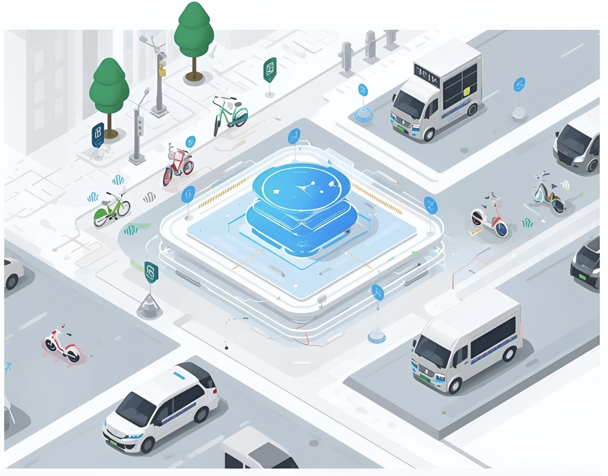

# Oreilly' Architectural Katas Q4 2025: AI-Enabled Architecture
> This repository documents the end-to-end architecture thinking process for the given kata scenario prepared by **Five Nines Team**.

---

## Table of Contents

- [About the Project](#about-the-project)
  - [Team](#team)
  - [Repository Structure](#repository-structure)
- [Problem Statement](#problem-statement)
  - [Business Goals and Drivers](requirements/1_0_Business%20goals%20%26%20drivers.md)
  - [Business Challenges](requirements/1_1_Business%20challenges.md)
  - [Functional Requirements](requirements/2_FRs.md)
  - [Non-Functional Requirements](requirements/3_NFRs.md)
  - [Assumptions and Constraints](requirements/4_Assumptions%20and%20constraints.md)
- [Solution Overview](#solution-overview)
  - [Business Capabilities Mapping](#business-capabilities-mapping)
  - [Tech Stack at a Glance](#tech-stack-at-a-glance)
- [Risks and Mitigations](requirements/5_Risks%20and%20mitigation.md)
- [Future Scope](requirements/Appendix%20C%3A%20Future%20scope.md)
- [References](#references)

---
## About the Project

This project is intended to help MobilityCorp achieve its business goals and address its biggest business challenges by offering the most optimal technology stack and architectural solution. The company's goals are: 
- increase sales and revenue,
- expand market coverage,
- improve user experience and satisfaction,
- strengthen its market position.

  

### Team

The project was prepared by the team called 'Five Nines' consisting of:

9 **[Oleh Yermilov](https://www.linkedin.com/in/oleg-yermilov-49a389113/)**

9 . **[Oleksandra Tytar](https://www.linkedin.com/in/otytar/)**

9 **[Dmitry Zinkevich](https://www.linkedin.com/in/zinkevich/)**
    
9 **[Piotr Zyskowski](https://www.linkedin.com/in/piotr-zyskowski-80588329/)**

9 **[Bo Connolly](https://www.linkedin.com/in/boconnolly/)**

### Repository Structure

- `adrs/` → Architecture Decision Records 
- `requirements/` → Business & technical requirements
- `hld/` → High Level Design artefacts (diagrams, docs)
---

## Problem Statement

Design from scratch (green field architecture) functionality for:
- **User Dialogue** - enhanced sales via user-personalized companionship, adaptive route/experience/pricing/charging advise, and driving compliance guidance;
- **Dynamic Pricing** - sales support with more competitive pricing, addresses expansion ambitions and retention goals;
- **Demand Forecasting** - uses internal and external data (weather, traffic, events) to forecast demand;
- **Maintenance Optimization** (cost reduction) via:
  - Operational efficiency (location/fleet/route supply optimisation, transportation/charge task assignment);
  - Load distribution (even rental/usage among vehicles);
  - Maintenance prediction (sensor data - e.g. battery);
 
while ensuring continuous and smooth system operation of the existing core rental functionality.

### [Business Goals and Drivers](requirements/1_0_Business%20goals%20%26%20drivers.md)

### [Business Challenges](requirements/1_1_Business%20challenges.md)

### [Functional Requirements](requirements/2_FRs.md)
* [Data Model Samples & Data Sourcing](hld/data-structure)

### [Non-Functional Requirements](requirements/3_NFRs.md)

### [Assumptions and Constraints](requirements/4_Assumptions%20and%20constraints.md)

---

## Solution Overview
Our goal is to design a micro-mobility platform for connected scooters, e-bikes, cars, and vans. The value proposition focuses on near-real-time telemetry, fleet state, pricing and demand intelligence, maintenance optimization, and conversational user assistance.

First, we integrated a [Trip Copilot](hld/scenarios/route-advice) AI companion into the MobilityCorp mobile app to recommend routes based on user location and preferences, weather, destination, and riding style, enhancing customer experience and retention.

Second, we used the AI companion to [gather customer feedback](hld/scenarios/feedback-analysis), which is analyzed to identify improvements and optimal parking bay locations, supporting our expansion strategy.

Next, we focused on vehicle quality and customer satisfaction by ingesting telemetry data into a custom [ML model](hld/scenarios/battery-replacement-and-fleet-allocation) to predict battery replacement timing and prevent ride failures.

Then, we designed an [ML-powered system](hld/scenarios/dynamic-pricing/README.md) to optimize pricing for customers based on multiple factors.

Lastly, we leveraged historical data and real-time route information to [forecast demand](hld/scenarios/demand-forecasting) and optimize fleet allocation to satisfy it.

### Business Capabilities Mapping

| Business Capability                        | Related FRs                                                                                                              | Related ADR / HLD Document |
|--------------------------------------------|--------------------------------------------------------------------------------------------------------------------------|--|
| **Core User Features**                     |   |
| User Registration and Login                | [1-1](requirements/Appendix%20A%3A%20Core%20functionality.md) | [Core Functionality](hld/core-func/README.md)   |
| Vehicle Search and Booking                 | [1-2](requirements/Appendix%20A%3A%20Core%20functionality.md) | [Core Functionality](hld/core-func/README.md)  |
| Booking (short-term / long-term)           | [1-3](requirements/Appendix%20A%3A%20Core%20functionality.md) | [Core Functionality](hld/core-func/README.md)  |
| Lock/Unlock Vehicles via Mobile App        | [1-4](requirements/Appendix%20A%3A%20Core%20functionality.md) | [Core Functionality](hld/core-func/README.md)  |
| Real-Time GPS Tracking                     | [1-5](requirements/Appendix%20A%3A%20Core%20functionality.md) | [Vehicle Connectivity HLD](hld/core-func/hld-vehicle-connectivity.md)   [ADR-0002 Vehicle telemetry & integration stack](adrs/ADR-0002%20-%20Vehicle%20telemetry%20%26%20integration%20stack.md)  |
| Secure Payment                             | [1-6](requirements/Appendix%20A%3A%20Core%20functionality.md) | [Core Functionality](hld/core-func/README.md)  |
| Return Flow (designated parking, proof)    | [1-7](requirements/Appendix%20A%3A%20Core%20functionality.md) | [Core Functionality](hld/core-func/README.md)  |
| Fees and Charges (penalties, late fees)    | [1-8](requirements/Appendix%20A%3A%20Core%20functionality.md) | [Core Functionality](hld/core-func/README.md)  |
| **Core Operations Features**               |                                                                                                                          |  |
| Fleet Overview Dashboard                   | [2-1](requirements/Appendix%20A%3A%20Core%20functionality.md) | [Core Functionality](hld/core-func/README.md)  [ADR-0007 Fleet Service](adrs/ADR-0007%20-%20Fleet%20Service%20as%20the%20Single%20Source%20of%20Truth%20for%20Vehicle%20State.md) |
| Vehicle Details and History                | [2-2](requirements/Appendix%20A%3A%20Core%20functionality.md) | [Core Functionality](hld/core-func/README.md)  [ADR-0007 Fleet Service](adrs/ADR-0007%20-%20Fleet%20Service%20as%20the%20Single%20Source%20of%20Truth%20for%20Vehicle%20State.md)  |
| Operational Control (lock/unlock, stop)    | [2-3](requirements/Appendix%20A%3A%20Core%20functionality.md) | [Core Functionality](hld/core-func/README.md)  [Vehicle Connectivity HLD](hld/core-func/hld-vehicle-connectivity.md)   [ADR-0002 Vehicle telemetry & integration stack](adrs/ADR-0002%20-%20Vehicle%20telemetry%20%26%20integration%20stack.md)   [ADR-0007 Fleet Service](adrs/ADR-0007%20-%20Fleet%20Service%20as%20the%20Single%20Source%20of%20Truth%20for%20Vehicle%20State.md)  |
| Task Management (battery swap, relocation) | [2-4](requirements/Appendix%20A%3A%20Core%20functionality.md) | [Core Functionality](hld/core-func/README.md)   [ADR-0007 Fleet Service](adrs/ADR-0007%20-%20Fleet%20Service%20as%20the%20Single%20Source%20of%20Truth%20for%20Vehicle%20State.md) |
| Fleet Monitoring (status, regulation data) | [2-5](requirements/Appendix%20A%3A%20Core%20functionality.md) | [Core Functionality](hld/core-func/README.md)   [Vehicle Connectivity HLD](hld/core-func/hld-vehicle-connectivity.md)   [ADR-0002 Vehicle telemetry & integration stack](adrs/ADR-0002%20-%20Vehicle%20telemetry%20%26%20integration%20stack.md)  |
| Support and Communication (user ↔ ops)     | [2-6](requirements/Appendix%20A%3A%20Core%20functionality.md) | [Core Functionality](hld/core-func/README.md)  |
| **Advanced / AI-Enabled Capabilities**     |                                                                                                                          | |
| Vehicle Rental & Booking                   | [FR#1](requirements/2_FRs.md)                                 | [ADR-0007 Fleet Service](adrs/ADR-0007%20-%20Fleet%20Service%20as%20the%20Single%20Source%20of%20Truth%20for%20Vehicle%20State.md) |
| Conversational Assistance (chatbot)        | [FR#2A, FR#2E](requirements/2_FRs.md)                         | [Trip Copilot](hld/scenarios/route-advice)   [ADR-0012 Hybrid AI for User-personalized in-app companionship](adrs/ADR-0012%20-%20Hybrid%20AI%20for%20User-personalized%20in-app%20companionship.md)   [ADR-0010 Agent Builder](adrs/ADR-0010%20-%20Evaluation%20and%20Adoption%20of%20Vertex%20AI%20Agent%20Builder%20for%20AI%20Service%20and%20Orchestration.md)  [ADR-0008 - Semantic Search on GCP](adrs/ADR-0008%20-%20Semantic%20Search%20on%20GCP.md) |
| Adaptive Route & Ride Experience           | [FR#2B, FR#2D](requirements/2_FRs.md)                         | [Feedback Analysis](hld/scenarios/feedback-analysis)   [ADR-0005 AI-Based Route Optimization](adrs/ADR-0005%20-%20AI-Based%20Route%20Optimization%20for%20Rental%20Vehicles.md)   [ADR-0004 Gemini for Maps & Search](adrs/ADR-0004%20-%20Use%20of%20Gemini%20for%20Maps%20%26%20Search%20Scenarios.md)   [ADR-0021 — Simple ML model for charging advice to user](adrs/ADR-0021%20-%20Simple%20ML%20model%20for%20charging%20advice.md) |
| Personalized Pricing Advice                | [FR#2C, FR#2F](requirements/2_FRs.md)                         | [Dynamic Pricing Calculation](hld/scenarios/dynamic-pricing/README.md)   [ADR-0003 Vertex AI as core AI/GenAI platform](adrs/ADR-0003%20-%20Vertex%20AI%20as%20core%20platform%20for%20AI%20and%20GenAI.md)   [ADR-0005 AI-Based Route Optimization](adrs/ADR-0005%20-%20AI-Based%20Route%20Optimization%20for%20Rental%20Vehicles.md) |
| Dynamic Pricing Engine                     | [FR#2F](requirements/2_FRs.md)                                | [Dynamic Pricing Calculation](hld/scenarios/dynamic-pricing/README.md)   [ADR-0003 Vertex AI as core AI/GenAI platform](adrs/ADR-0003%20-%20Vertex%20AI%20as%20core%20platform%20for%20AI%20and%20GenAI.md)   [ADR-0005 AI-Based Route Optimization](adrs/ADR-0005%20-%20AI-Based%20Route%20Optimization%20for%20Rental%20Vehicles.md)   [ADR-0018 — Hybrid AI for Dynamic Pricing calculation](adrs/ADR-0018%20-%20Hybrid%20AI%20for%20Dynamic%20Pricing%20calculation.md) |
| Demand Forecasting                         | [FR#2G](requirements/2_FRs.md)                                | [Demand Forecasting](hld/scenarios/demand-forecasting)   [ADR-0003 Vertex AI as core AI/GenAI platform](adrs/ADR-0003%20-%20Vertex%20AI%20as%20core%20platform%20for%20AI%20and%20GenAI.md)   [ADR-0006 Knowledge Management](adrs/ADR-0006%20-%20Knowledge%20Management%20on%20GCP%20with%20Vertex%20AI%20Integration.md)   [ADR-0022 Demand Forecasting Model Selection and Architecture](adrs/ADR-0022%20-%20Demand%20Forecasting%20Model%20Selection%20and%20Architecture.md) |
| Fleet Supply & Task Optimization           | [FR#2I](requirements/2_FRs.md)                                | [Fleet Allocation](hld/scenarios/battery-replacement-and-fleet-allocation)   [ADR-0007 Fleet Service](adrs/ADR-0007%20-%20Fleet%20Service%20as%20the%20Single%20Source%20of%20Truth%20for%20Vehicle%20State.md)   [ADR-0005 AI-Based Route Optimization](adrs/ADR-0005%20-%20AI-Based%20Route%20Optimization%20for%20Rental%20Vehicles.md) |
| Load Distribution Optimization             | [FR#2J](requirements/2_FRs.md)                                | [Fleet Allocation](hld/scenarios/battery-replacement-and-fleet-allocation)   [ADR-0007 Fleet Service](adrs/ADR-0007%20-%20Fleet%20Service%20as%20the%20Single%20Source%20of%20Truth%20for%20Vehicle%20State.md)   [ADR-0005 AI-Based Route Optimization](adrs/ADR-0005%20-%20AI-Based%20Route%20Optimization%20for%20Rental%20Vehicles.md) |
| Predictive Maintenance & Cost Forecasting  | [FR#2K](requirements/2_FRs.md)                                | [Battery Replacement](hld/scenarios/battery-replacement-and-fleet-allocation)   [ADR-0003 Vertex AI as core AI/GenAI platform](adrs/ADR-0003%20-%20Vertex%20AI%20as%20core%20platform%20for%20AI%20and%20GenAI.md)   [ADR-0007 Fleet Service](adrs/ADR-0007%20-%20Fleet%20Service%20as%20the%20Single%20Source%20of%20Truth%20for%20Vehicle%20State.md)   [ADR-0019 - Hybrid AI for Maintenance Optimization: Supply Efficiency](adrs/ADR-0019%20-%20Hybrid%20AI%20for%20Maintenance%20Optimization%3A%20Supply%20Efficiency.md)|
| **ML Operations**                          |                                                                                                                          |  |
| AI Knowledge Data Management               | [FR#3](requirements/2_FRs.md)                                 | [ADR-0009 - GenAI Model Management on GCP](adrs/ADR-0009%20-%20GenAI%20Model%20Management%20on%20GCP.md)   [ADR-0010 - Evaluation and Adoption of Vertex AI Agent Builder for AI Service and Orchestration](adrs/ADR-0010%20-%20Evaluation%20and%20Adoption%20of%20Vertex%20AI%20Agent%20Builder%20for%20AI%20Service%20and%20Orchestration.md)   [ADR-0011 - Model Evaluation Flow using Vertex AI](adrs/ADR-0011%20-%20Model%20Evaluation%20Flow%20using%20Vertex%20AI.md)   [ADR-0013 — Adoption of Managed SaaS Model Control Plane (MoCoP)](adrs/ADR-0013%20-%20Adoption%20of%20Managed%20SaaS%20Model%20MoCoP.md)   [ADR-0014 — ML Model Selection for Cleanliness Assessment](adrs/ADR-0014%20-%20ML%20Model%20Selection%20for%20Cleanliness%20Assessment.md) |
| MLOps                                      | [FR#3](requirements/2_FRs.md)  | [MLOps on Vertex AI & Gemini](hld/mlops/README.md)   [ADR-0015 — Training Data Strategy and Bias Mitigation for Vision Models](adrs/ADR-0015%20-%20Training%20Data%20Strategy%20and%20Bias%20Mitigation%20for%20Vision%20Models.md)   [ADR-0016 — Human-in-the-Loop Workflow Design for AI Decisions](adrs/ADR-0016%20-%20Human-in-the-Loop%20Workflow%20Design%20for%20AI%20Decisions.md) |
| **Analytics Capabilities**                 |  |   |
| Data And Analytics Architecture            |  [FR(Ap.A)2-1](requirements/Appendix%20A%3A%20Core%20functionality.md)| [Data and Analytics Technology Architecture](hld/core-func/hld-data-and-analytics.md)  |

### Tech Stack at a Glance  

**Edge and connectivity**

- Vehicles use MQTT over cellular
- Clustered MQTT gateway on GKE behind external load balancer
- Gateway authenticates devices, buffers if offline, and publishes telemetry to Pub/Sub topics by region and vehicle type

**Streaming and integration**
- Pub/Sub as event backbone for telemetry and commands
- Dataflow pipelines for parsing, validation, dedupe, geofencing enrichment, road snapping, and fan-out to storage and APIs

**Data and Analytics**

- Ingestion: streaming, micro-batch, and bulk batch modes across transactional sources, vehicle telemetry, files, APIs, and reference data
- Persistence: multi-layer lakehouse with raw, bronze, silver, gold, feature store, and curated semantic layer
- Processing: Dataflow (stream/batch), Dataproc/Spark, BigQuery SQL, Vertex AI for feature engineering and ML pipelines; orchestrated with Airflow/Prefect/Dagster
- Analytics Surfaces: governed semantic layer, BI dashboards in Looker, SQL/Notebook workspaces, ML experiment tracking, curated APIs
- Reliability: multi-AZ baseline, optional multi-region with RPO 0–5 min (streaming) and RTO ≈15 min for critical services
- Governance: schema contracts, lineage, RBAC/ABAC, PII tokenization, audit logs ≥400 days
- FinOps & Ops: unit cost tracking, observability (lag, throughput, error rates), structured logging, OpenTelemetry tracing

**AI and GenAI**
- Vertex AI for model lifecycle and evaluation
- Gemini for map grounded conversational search and ops copilots
- Matching Engine and BigQuery vector search for retrieval and RAG
- Agent Builder for tool calling and orchestration of fleet, maps, and pricing tools
- [MLOps](/hld/mlops/MLOps%20on%20Vertex%20AI%20%26%20Gemini.md) for automating full ML model lifecycle

**Applications**
- Cloud Run microservices for booking, pricing, ops, maintenance
- API Gateway for external and mobile access
- Identity Platform for auth

**Geospatial and UX**
- Maps Platform for routing, POI, geocoding, traffic, and ETA
- Ops UI and mobile client consume APIs and AI assistants

## [Risks and Mitigations](requirements/5_Risks%20and%20mitigation.md)
## [Future Scope](requirements/Appendix%20C%3A%20Future%20scope.md)

_______
## References:
- [Google Cloud](https://cloud.google.com/)
- [Vertex AI](https://cloud.google.com/vertex-ai)
- [Gemini (Google AI)](https://ai.google.dev/gemini-api)
- [BigQuery](https://cloud.google.com/bigquery)
- [MQTT (OASIS Standard v5.0)](https://docs.oasis-open.org/mqtt/mqtt/v5.0/mqtt-v5.0.html)
- [EU Micromobility Regulation Overview (EC Urban Mobility Observatory)](https://urban-mobility-observatory.transport.ec.europa.eu/resources/case-studies/overview-policy-relating-e-scooters-european-countries_en)
