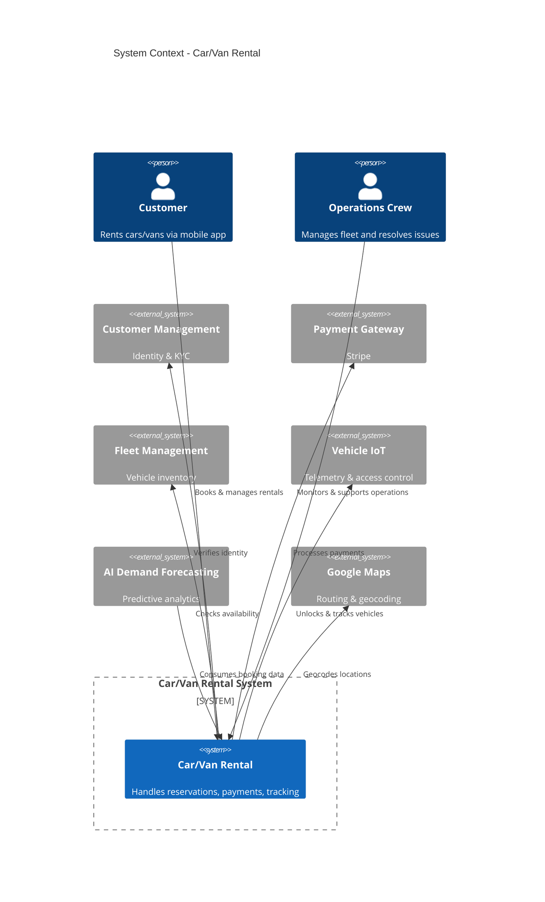

# Car/Van Rental - System Context Diagram

## Purpose
Shows how the Car/Van Rental system fits into the broader MobilityCorp ecosystem.

## Diagram

## Key Insights
- Single Responsibility: This context ONLY handles car/van rentals (bikes/scooters separate)
- External Dependencies: 6 upstream systems (see Integration Requirements)
- Downstream Consumers: AI Forecasting, Mobile App, Admin Dashboard

