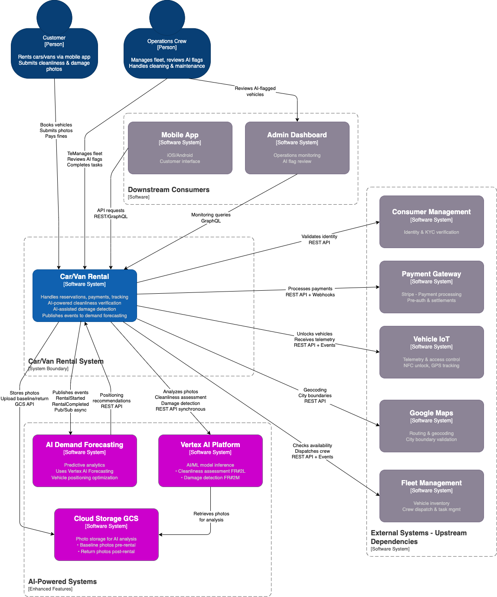

# Car/Van Rental - System Context Diagram

## Purpose
Shows how the Car/Van Rental system fits into the broader MobilityCorp ecosystem.

## Diagram


## Diagram Legend

### Colors
- 🔵 **Dark Blue** - Actors (Customer, Operations Crew)
- 🟦 **Blue** - Car/Van Rental System (main system in scope)
- ⚫ **Grey** - External operational systems (Consumer Mgmt, Payment, IoT, Maps, Fleet)
- 🟣 **Purple** - AI-Powered systems (Vertex AI, Cloud Storage, Demand Forecasting)

### Relationship Types
- **Solid arrows** (→) - Synchronous interactions, API calls
- **Dashed arrows** (⇢) - Asynchronous interactions, events, background processes
- **Labels** - Describe the interaction type and protocol

### Key AI Integration Points ⭐

1. **Photo Upload & Storage Flow:**
   ```
   Customer → Car/Van Rental → Cloud Storage (GCS)
   ```
   - Baseline photos (pre-rental) stored for comparison
   - Return photos (post-rental) stored for AI analysis

2. **AI Cleanliness Assessment (FR#2L):**
   ```
   Car/Van Rental → Cloud Storage → Vertex AI Vision
   ```
   - Synchronous REST API call
   - Returns confidence score + cleanliness flags
   - Human review if confidence < 90%

3. **AI Damage Detection (FR#2M):**
   ```
   Car/Van Rental → Cloud Storage → Vertex AI Vision (custom model)
   ```
   - Detects dents, scratches, cracks
   - Confidence thresholds: >85% auto-flag, 70-85% suggest review

4. **AI Demand Forecasting (FR#2H):**
   ```
   Car/Van Rental → [Pub/Sub] → AI Demand Forecasting
   AI Demand Forecasting → [REST API] → Car/Van Rental
   ```
   - Asynchronous event publishing (rental lifecycle events)
   - Receives positioning recommendations for crew dispatch

---

## System Counts

**Total External Systems:** 8
- Upstream dependencies: 5 (Consumer Mgmt, Payment, Vehicle IoT, Google Maps, Fleet Mgmt)
- AI-powered systems: 3 (Vertex AI, Cloud Storage, AI Demand Forecasting)
- Downstream consumers: 2 (Mobile App, Admin Dashboard)

**Comparison to Current Diagram:**
- **Added:** Vertex AI Platform (critical AI inference)
- **Added:** Cloud Storage GCS (photo pipeline)
- **Clarified:** AI Demand Forecasting (uses Vertex AI internally)

---

## ADR Traceability

- **ADR-0003:** Vertex AI as core platform for AI and GenAI → Shown as primary AI system
- **ADR-0001:** GCP as main cloud provider → Cloud Storage (GCS), Vertex AI, Pub/Sub integration
- **ADR-0002:** Vehicle telemetry & integration stack → Vehicle IoT system shown

---

## Functional Requirement Coverage

| Requirement | System(s) Involved | Visible on Diagram? |
|-------------|-------------------|---------------------|
| FR#2L: Cleanliness Verification | Vertex AI, Cloud Storage, Car/Van Rental | ✅ Yes - Purple systems |
| FR#2H: Demand Forecasting | AI Demand Forecasting, Car/Van Rental | ✅ Yes - Bi-directional arrows |
| FR#2M: Damage Detection | Vertex AI, Cloud Storage, Car/Van Rental | ✅ Yes - Same pipeline as cleanliness |
| FR-CV-001: Booking | Consumer Mgmt, Payment, Fleet Mgmt | ✅ Yes - External dependencies |
| FR-CV-005: NFC Unlock | Vehicle IoT | ✅ Yes - Telemetry & access control |
| FR-CV-007: Return Verification | Vertex AI, Cloud Storage | ✅ Yes - Photo analysis flow |


