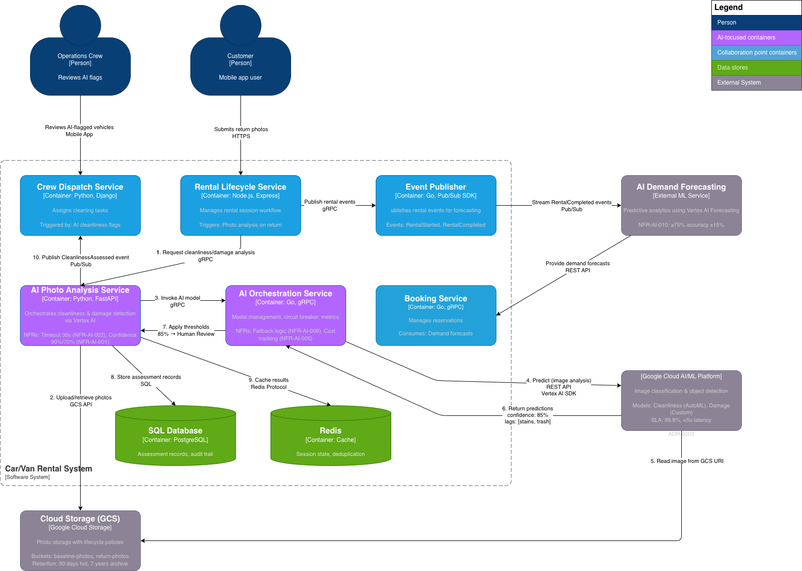

# AI-Focused Container Diagram (Graph Syntax)


---

## Key Flows Highlighted

### Flow 1: Cleanliness Verification (Numbered Steps 1-10)
```
Customer → Rental Service → AI Photo Analysis → Upload GCS → AI Orchestration 
→ Vertex AI Vision → Predictions → Threshold Logic → Store PostgreSQL 
→ Publish Event → Crew Dispatch
```

### Flow 2: Damage Detection (Similar Pattern)
```
Customer → Rental Service → AI Photo Analysis → Vertex AI (custom model) 
→ Bounding boxes → Return to app → Customer confirms
```

### Flow 3: Demand Forecasting (Event-Driven)
```
Rental Service → Event Publisher → Pub/Sub → AI Demand Forecasting 
→ Vertex AI Forecasting → Forecasts → Booking Service → Customer
```
---

## NFR Annotations on Diagram

Each container shows relevant NFRs:

**AI Photo Analysis Service:**
- NFR-AI-002: Timeout 30s, fallback to human review
- NFR-AI-001: Confidence thresholds 90%, 70%
- NFR-AI-008: Graceful degradation

**AI Orchestration Service:**
- NFR-AI-003: Drift detection, model monitoring
- NFR-AI-004: Vendor abstraction layer
- NFR-AI-005: Cost tracking ($0.002/prediction)
- NFR-AI-008: Circuit breaker pattern

**Rental Lifecycle Service:**
- NFR-CV-002: Vehicle unlock ≤3s (not blocked by AI)

**Crew Dispatch Service:**
- NFR-AI-006: Explainability (photo highlights, bounding boxes)

**Vertex AI Vision:**
- SLA: 99.9% availability, <5s latency (p95)
- ADR-0003: Core AI platform decision

**Cloud Storage (GCS):**
- Retention: 90 days hot, 7 years archive (GDPR compliance)
- Security: Signed URLs (15-minute expiry)

**AI Demand Forecasting:**
- NFR-AI-010: ≥75% accuracy within ±15% margin

---

## Technology Stack Summary Table

| Container | Language | Framework | Key Libraries | Database | AI Integration |
|-----------|----------|-----------|---------------|----------|----------------|
| AI Photo Analysis | Python 3.11 | FastAPI | Vertex AI SDK, Pillow | PostgreSQL + Redis | Direct (Vertex AI Vision) |
| AI Orchestration | Go 1.21 | gRPC | Go-Resilience, Prometheus | TimescaleDB + Firestore | Wrapper/Proxy layer |
| Rental Lifecycle | Node.js 20 | Express | gRPC client | PostgreSQL + Redis | Client (Photo Analysis) |
| Event Publisher | Go 1.21 | Pub/Sub SDK | Avro schema | N/A | Publishes to forecasting |
| Crew Dispatch | Python 3.11 | Django REST | Cloud Tasks | PostgreSQL | Subscriber (AI events) |
| Booking | Go 1.21 | gRPC | PostgreSQL driver | PostgreSQL | Client (forecasting API) |

---

## ADR Traceability Matrix

| Architectural Decision | ADR Reference | Container(s) Impacted | Visibility on Diagram |
|------------------------|---------------|----------------------|----------------------|
| Vertex AI as core AI platform | ADR-0003 | AI Photo Analysis, AI Orchestration | ✅ Badge on Vertex AI box |
| GCP as main cloud provider | ADR-0001 | Cloud Storage, Vertex AI | ✅ External systems section |
| Python for AI services | ADR-TBD | AI Photo Analysis, Crew Dispatch | ✅ Tech stack labels |
| Go for high-performance services | ADR-TBD | AI Orchestration, Event Publisher, Booking | ✅ Tech stack labels |
| Pub/Sub for async events | ADR-0002 | Event Publisher, AI Forecasting integration | ✅ Arrow labels |
| PostgreSQL for ACID compliance | ADR-TBD | All services | ✅ Database node |
| Circuit breaker for AI calls | Best Practice | AI Orchestration | ✅ Pattern annotation |
