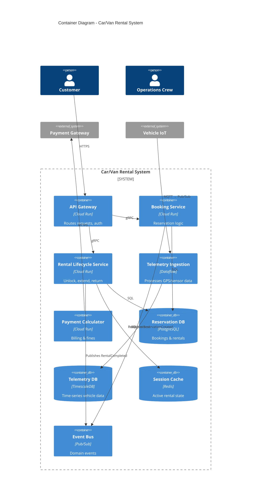

# Car/Van Rental - Container Diagram

## Purpose
Shows the internal containers (services, databases) within the Car/Van Rental system.

## Diagram

## Container Responsibilities
Booking Service
  - Purpose: Manage reservations
  - Tech Stack: Go, gRPC
  - Data Store: PostgreSQL (ACID compliance)
  - Related ADR: ADR-0001 (PostgreSQL choice)

Rental Lifecycle Service
  - Purpose: Handle unlock → track → return flow
  - Tech Stack: Node.js, REST + gRPC
  - Data Store: PostgreSQL + Redis (session state)
  - Related ADR: ADR-0003 (Sync unlock decision)

Telemetry Ingestion Service
  - Purpose: Process high-volume GPS/sensor streams
  - Tech Stack: Apache Beam (Dataflow)
  - Data Store: TimescaleDB
  - Related ADR: ADR-0002 (TimescaleDB choice)
  
[Continue for each container...]