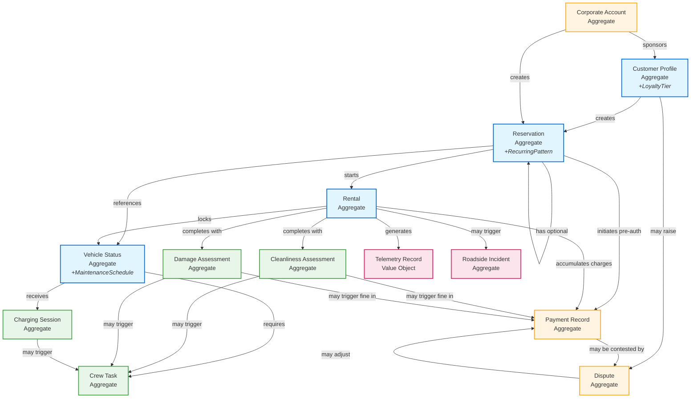

# Car/Van Rental - Domain Model

## Ubiquitous Language
**Bounded Context:** Car/Van Rental  
**Domain Experts:** Fleet Operations Manager, Customer Success Lead

### Core Terms
| Term | Definition | Example |
|------|------------|---------|
| **Reservation** | Pre-booked timeslot for vehicle usage | "Reservation #12345 for Tesla Model 3, Dec 18 10:00-12:00" |
| **Recurring Pattern** | Standing reservation rules for repeated bookings | "Every Monday 8am-6pm for 6 months, skip allowed with 24h notice" |
| **Rental Session** | Active usage period from unlock to return | "Rental in progress, 47 minutes elapsed" |
| **Return Verification** | Photo + location proof of proper parking | "User submitted parking bay photo, AI verified charger connection" |
| **Pre-Authorization** | Payment hold before rental starts | "€150 pre-auth on Visa ending 4242" |
| **Fine** | Penalty charge for policy violation | "€25 late return fine, €50 dirty vehicle fine" |
| **Dispute** | Customer challenge to charges with evidence | "Customer contested €100 cleaning fee with counter-photos, pending review" |
| **Loyalty Tier** | Membership level with benefits and discounts | "Gold tier: 15% discount, priority support, extended waivers" |
| **Cleanliness Assessment** | AI-powered photo analysis of vehicle condition | "AI flagged interior stains (confidence 72%), crew review required" |
| **Damage Assessment** | AI detection of vehicle damage with bounding boxes | "Detected dent on rear panel (85% confidence), €200 repair estimate" |
| **Charging Session** | Vehicle charging at partner location | "Charged 45 kWh at Shell Recharge, Amsterdam, €18.90 reimbursed" |
| **Crew Task** | Maintenance operation assignment | "Relocate fully-charged Vehicle #789 from charger bay to parking" |
| **Maintenance Schedule** | Vehicle servicing timeline and tracking | "Due for 90-day inspection at 8,500 km odometer" |
| **Corporate Account** | B2B customer entity with multiple users | "Acme Corp account with 50 employees, €5,000 monthly cap, bulk billing" |

### Aggregates

**Color Legend:**
- 🔵 **Blue** - Core Booking Flow (customer-facing rental lifecycle)
- 🟡 **Orange** - Payment & Financial (billing, pre-auth, fines)
- 🟢 **Green** - Operations & Maintenance (crew tasks, vehicle servicing)
- 🔴 **Pink** - Monitoring & Incidents (telemetry, roadside assistance)

**Aggregate Root Descriptions:**

1. **Customer Profile** - Individual user account with embedded **Loyalty Tier** (Bronze/Silver/Gold), favorites, preferences, payment methods, rental history
2. **Corporate Account** - B2B entity with multiple employee users, consolidated billing, usage caps, volume discounts, admin portal access
3. **Reservation** - Booking with time window, vehicle reference, pre-authorization, optional **Recurring Pattern** (rules, skip history, expiration)
4. **Rental** - Active usage session with start/end timestamps, billing accumulator, telemetry tracking, extension requests, late fee calculation
5. **Vehicle Status** - Real-time vehicle state (location, charge, availability, cleanliness, maintenance flags) with embedded **Maintenance Schedule**
6. **Payment Record** - Financial transactions (pre-auth, charges, fines, refunds) with audit trail, multi-currency support, retry logic
7. **Dispute** - Customer challenge to charges with evidence (photos, timestamps), review status, decision audit trail, escalation path
8. **Crew Task** - Maintenance operations (relocation, cleaning, charging, inspection) with dispatch queue, route optimization, completion photos
9. **Charging Session** - Vehicle charging activity at partner locations with kWh tracking, cost reimbursement, charger blocking detection
10. **Cleanliness Assessment** - AI photo-based condition analysis (confidence scores, human review queue) with fee calculation and dispute linkage
11. **Damage Assessment** - AI damage detection with bounding boxes, severity classification, repair cost estimation, insurance integration
12. **Roadside Incident** - Breakdown/assistance requests with issue type, location, crew assignment, resolution status, SLA tracking
13. **Telemetry Record** - Time-series vehicle data (GPS, battery, speed) - modeled as Value Object for high-volume streaming (30-second intervals)

### Domain Events

**Reservation Lifecycle:**
- `ReservationCreated` - New booking made (single or recurring pattern)
- `ReservationModified` - Booking details changed (time, vehicle, location)
- `ReservationCancelled` - Booking cancelled by customer or system
- `RecurringPatternCreated` - Standing reservation established (e.g., every Monday for 6 months)
- `RecurringOccurrenceSkipped` - Individual occurrence skipped with 24h notice
- `RecurringPatternExpired` - Recurring pattern reached end date or max occurrences
- `ReservationNoShow` - Customer failed to unlock within 30 minutes (€25 fee applied)

**Rental Lifecycle:**
- `RentalStarted` - Vehicle unlocked, session begins, billing starts
- `RentalExtensionRequested` - Customer requested duration extension during active rental
- `RentalExtensionApproved` - Extension granted (no conflicting booking)
- `RentalExtensionDenied` - Extension rejected due to conflict
- `RentalCompleted` - Vehicle returned, session ended
- `ReturnVerified` - Photos validated, parking confirmed, charger connected (AI confidence >80%)
- `ReturnPhotosPending` - Return requires human review (AI confidence <80%)
- `LateReturnDetected` - Vehicle returned after grace period (€0.50/min fee)

**Vehicle Operations:**
- `VehicleStatusChanged` - Availability, location, or charge level updated
- `TelemetryReceived` - GPS, battery, speed data ingested (high-frequency, 30-second intervals)
- `ChargingStarted` - Vehicle connected to partner charger
- `ChargingCompleted` - Vehicle fully charged, may need relocation
- `ChargerBlockingDetected` - Vehicle left >60min after 80% charge (€10 fee)
- `VehicleDisabled` - Remote disable triggered for security/theft (2FA required)
- `MaintenanceRequired` - Vehicle hit 90% odometer threshold or sensor malfunction
- `MaintenanceCompleted` - Vehicle returned to active fleet after servicing
- `CrossBorderViolation` - Vehicle detected in wrong return city (€150 + €1.50/km fine)

**Payment & Financial:**
- `PreAuthorizationCreated` - Payment hold placed on customer card
- `PreAuthorizationReleased` - Hold released after cancellation
- `PaymentCharged` - Final rental cost captured
- `PaymentFailed` - Charge declined, retry with fallback method initiated
- `FineApplied` - Penalty assessed (late return, cleaning, wrong location, charger blocking)
- `FineWaiverApplied` - First-time offense waiver or loyalty tier benefit
- `RefundIssued` - Customer refund processed
- `MultiCurrencyRateUpdated` - Daily exchange rate refresh for 6 supported currencies

**Cleanliness & Damage:**
- `CleanlinessAssessed` - AI analyzed return photos (confidence score, severity level)
- `CleaningFeeProposed` - Fee calculated (Minor €50, Major €100, Severe €150), pending crew review
- `CleaningFeeConfirmed` - Crew approved fee, customer charged
- `DamageDetected` - AI identified damage with bounding boxes (confidence >85% auto-flag)
- `DamageReportCreated` - Crew validated damage, repair quote generated
- `DamageFeeApplied` - Actual repair cost charged (uncapped)

**Dispute Management:**
- `DisputeRaised` - Customer contested charge within 48h window with evidence
- `DisputeUnderReview` - Human review assigned (5-day decision SLA)
- `DisputeApproved` - Customer dispute accepted, refund issued
- `DisputeRejected` - Dispute denied, original charge stands
- `DisputeEscalated` - Customer escalated to senior operations (one-time allowed)

**Maintenance & Operations:**
- `CrewTaskCreated` - Maintenance operation assigned (cleaning, relocation, inspection, charging)
- `CrewTaskAssigned` - Task routed to specific crew member
- `CrewTaskCompleted` - Task finished, completion photos uploaded
- `DemandForecastUpdated` - AI predicted demand by zone/time/vehicle type (hourly refresh)
- `RepositioningRecommended` - Demand forecast triggered crew relocation task

**Incident Management:**
- `RoadsideIncidentReported` - Customer requested assistance via app
- `CrewDispatched` - Nearest crew assigned (<30min urban SLA)
- `IncidentResolved` - Assistance completed, vehicle recovered or repaired

**Corporate Accounts:**
- `CorporateAccountCreated` - B2B customer onboarded with bulk pricing
- `EmployeeAddedToAccount` - User granted access to corporate account
- `EmployeeRemovedFromAccount` - User access revoked
- `UsageCapExceeded` - Corporate account hit monthly limit
- `CorporateUsageReportGenerated` - Monthly consolidated billing report

**Loyalty & Rewards:**
- `LoyaltyTierUpgraded` - Customer upgraded to Silver/Gold based on 30-day usage
- `LoyaltyTierDowngraded` - Customer dropped tier due to reduced usage
- `LoyaltyDiscountApplied` - Tier discount (10% Silver, 15% Gold) applied to rental

---

## Aggregate Consistency Boundaries

### Transactional Consistency (Strong)
Within a single aggregate, changes are **ACID-compliant** and immediately consistent:

- **Reservation Aggregate**: Booking details, pre-auth reference, recurring pattern rules
- **Rental Aggregate**: Session state, billing accumulator, current telemetry snapshot
- **Payment Record Aggregate**: Transaction state, fine calculations, refund tracking
- **Vehicle Status Aggregate**: Availability flag, location, charge level, maintenance state

### Eventual Consistency (Across Aggregates)
Cross-aggregate updates use **domain events** for eventual consistency:

- **Reservation → Vehicle**: `ReservationCreated` event updates Vehicle availability (eventually consistent)
- **Rental → Payment**: Billing events accumulate charges asynchronously
- **Cleanliness → Crew**: Assessment triggers task creation via event
- **Charging → Vehicle**: Charge completion updates vehicle status via telemetry events

**Rationale:** 
- Prevents distributed transactions across bounded contexts
- Enables independent scaling of aggregates
- Maintains system resilience during partial failures
- Supports event sourcing for audit trails

### Key Relationships

**1. Customer/Corporate → Reservation (1:Many)**
- One customer can have multiple active reservations
- One corporate account can have reservations across multiple employees
- Enforced at application layer, not FK constraint

**2. Reservation → Rental (1:1)**
- Each reservation may spawn one active rental session
- Rental references reservation ID but doesn't require FK
- Decoupled for flexibility (walk-up rentals in future)

**3. Rental → Vehicle (Many:1)**
- Multiple rentals (over time) reference same vehicle
- Vehicle status updated via events, not direct FK

**4. Rental → Payment (1:Many)**
- One rental generates multiple payment records (pre-auth, charges, fines)
- Payment aggregate references rental ID for correlation

**5. Vehicle → Crew Task (1:Many)**
- One vehicle may have multiple pending crew tasks
- Tasks reference vehicle ID but remain independent aggregate

**6. Rental → Cleanliness Assessment (1:1)**
- Each rental completion triggers one cleanliness assessment
- Assessment may exist independently for pre-rental checks

---

## Design Rationale

### Why These Aggregate Boundaries?

1. **Reservation as Aggregate Root:**
   - Booking is the customer's primary interaction point
   - Encapsulates all booking-related rules (conflicts, extensions, recurring patterns)
   - Pre-authorization lifecycle tied to reservation state

2. **Rental as Separate Aggregate:**
   - Active session has different lifecycle than booking
   - Billing accumulates in real-time during rental
   - Telemetry streaming requires separate scalability profile
   - Decoupling enables walk-up rentals (future scope)

3. **Vehicle Status as Aggregate:**
   - Vehicle is shared resource across many rentals
   - Real-time availability requires independent consistency
   - Charge level updated by telemetry, not rental events
   - Maintenance state managed by operations, not customers

4. **Payment Record as Aggregate:**
   - Financial transactions require audit trail isolation
   - Compliance mandates independent payment records
   - Enables payment gateway failures without blocking rentals
   - Supports complex refund/chargeback workflows

**5. Crew Task as Aggregate:**
   - Operations domain separate from customer rentals
   - Route optimization requires batch processing
   - Task assignment independent of vehicle availability
   - Enables crew mobile app to work offline

6. **Dispute as Aggregate:**
   - Customer disputes require independent audit trail
   - Evidence management (photos, timestamps) isolated from payment flow
   - Review workflow with SLA tracking (48h submission, 5-day decision)
   - Enables escalation path separate from original transaction

7. **Damage Assessment as Separate Aggregate (from Cleanliness):**
   - Damage detection requires different AI models (object detection vs classification)
   - Repair cost estimation workflow distinct from cleaning fees
   - Insurance integration separate concern
   - Enables parallel processing of cleanliness and damage at return

8. **Corporate Account as Aggregate:**
   - B2B billing domain separate from individual customers
   - Multi-tenant employee management with access controls
   - Usage cap enforcement requires independent transaction boundary
   - Consolidated reporting requires separate data lifecycle

9. **Telemetry as Value Object:**
   - High-frequency time-series data (30-second intervals)
   - Immutable records, no business logic
   - Optimized for streaming ingestion and analytics
   - Not an aggregate root (no identity required)

10. **Loyalty Tier as Value Object (Embedded in Customer):**
   - Tier calculation based on rolling 30-day usage
   - Discount rules tightly coupled to customer identity
   - Auto-upgrade/downgrade logic embedded in Customer aggregate
   - Not independent entity (no lifecycle outside Customer)

11. **Recurring Pattern as Value Object (Embedded in Reservation):**
   - Recurrence rules (frequency, end date) owned by reservation
   - Skip history tracked within reservation context
   - Pattern expiration managed by reservation lifecycle
   - Not independent entity (no meaning without parent reservation)

