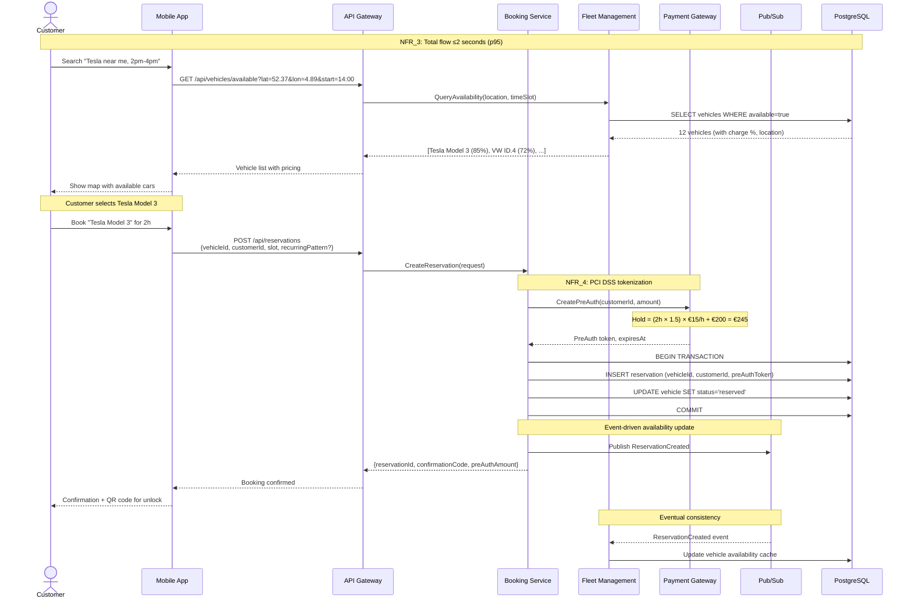
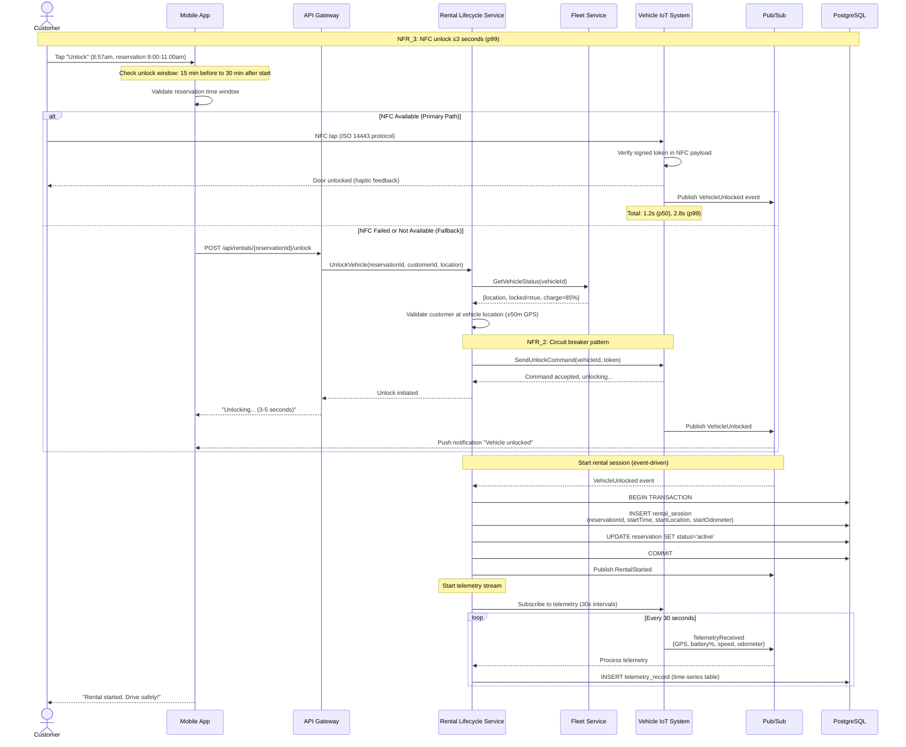
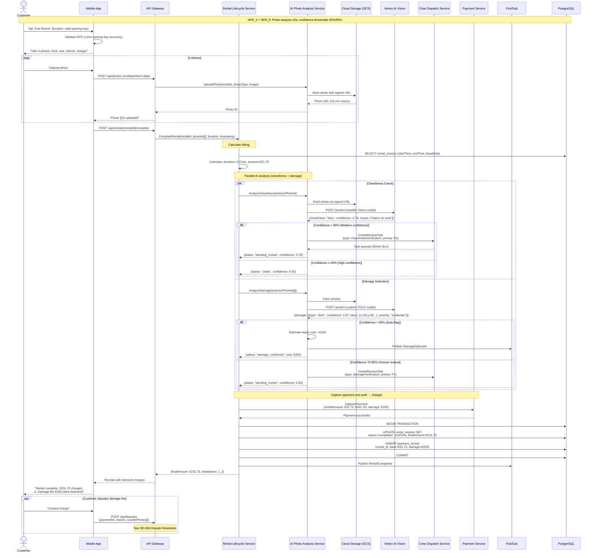
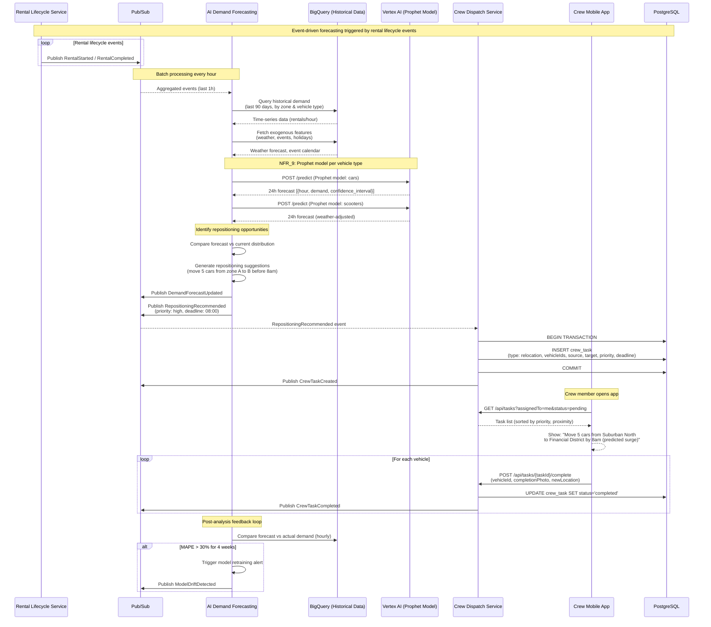
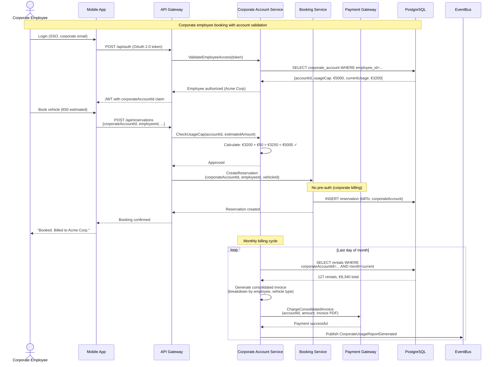
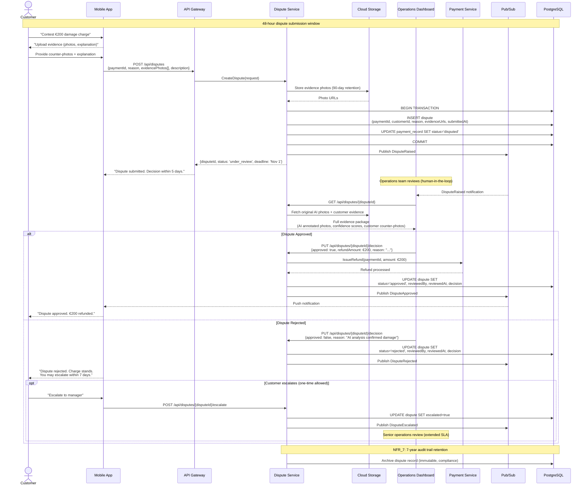
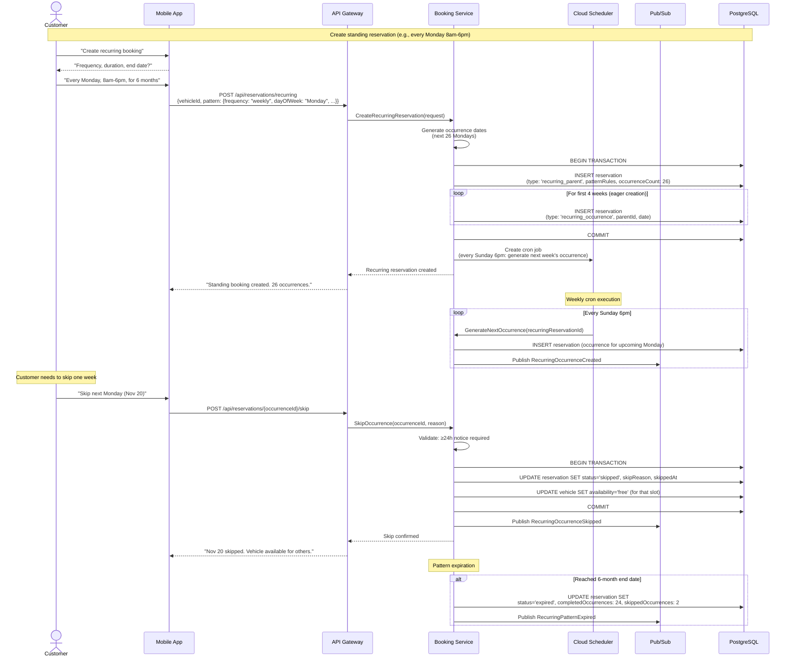

# Car/Van Rental - Key Sequence Diagrams

> **Coverage:** These sequences represent critical paths through the car/van rental system, showing interactions between containers, external systems, and domain aggregates. NFR annotations highlight performance and reliability requirements.

---

## SD-001: Booking Flow (Happy Path)

**Functional Requirements:** FR#1-2 (Vehicle Search), FR#1-3 (Booking), FR#1-6 (Payment)  
**NFRs:** NFR_3 (Performance: Booking ≤2s), NFR_4 (Security: PCI DSS), NFR_1 (Scalability: 500 searches/sec peak)  
**ADRs:** ADR-0001 (GCP), ADR-0002 (Pub/Sub events)

**Key Decisions:**
- Pre-authorization created **before** reservation insert (fail-fast on payment issues)
- Vehicle availability update via event (eventual consistency acceptable for non-critical path)
- Confirmation QR code includes signed JWT for secure unlock (15-min expiry)

---

## SD-002: Unlock & Start Rental (NFC + Fallback)

**Functional Requirements:** FR#1-4 (Lock/Unlock), FR#1-5 (GPS Tracking)  
**NFRs:** NFR_3 (Performance: Unlock ≤3s p99), NFR_2 (Reliability: Circuit breakers)  
**ADRs:** ADR-0002 (Vehicle telemetry), ADR-0007 (Fleet Service as SSOT)

**Key Decisions:**
- NFC primary method for best UX (1-3s unlock)
- Remote API fallback for devices without NFC or signal issues
- GPS validation (±50m) prevents unlock fraud
- Telemetry starts immediately after unlock (30s intervals)
- Circuit breaker on Vehicle IoT calls (fail gracefully if down)

---

## SD-003: Return & AI Photo Verification (Cleanliness + Damage)

**Functional Requirements:** FR#1-7 (Return Flow), FR#2L (Cleanliness), FR#2M (Damage Detection)  
**NFRs:** NFR_9 (AI: Confidence 90% cleanliness, 85% damage), NFR_3 (Performance: Photo analysis ≤5s)  
**ADRs:** ADR-0003 (Vertex AI), ADR-0014 (ML Model Selection), ADR-0016 (Human-in-the-Loop), ADR-0017 (Photo Retention 90d)

**Key Decisions:**
- Parallel AI analysis (cleanliness + damage) for performance
- Confidence thresholds trigger human review (ADR-0016)
- Photos stored 90 days (ADR-0017: GDPR compliance)
- Payment capture only after AI analysis completes
- Dispute window opens immediately after charge

---

## SD-004: AI Demand Forecasting & Crew Repositioning

**Functional Requirements:** FR#2H (Demand Forecasting), FR-CV-027 (Crew Tasks)  
**NFRs:** NFR_9 (AI: Forecasting 75-80% accuracy), NFR_3 (Performance: Forecast ≤60s)  
**ADRs:** ADR-0022 (Demand Forecasting Model), ADR-0011 (Model Evaluation), ADR-0006 (BigQuery)

**Key Decisions:**
- Hourly batch processing (not real-time) to balance accuracy vs cost
- Separate Prophet models per vehicle type (cars vs scooters)
- Weather impact weighted differently (scooters -60%, cars +10%)
- Crew tasks include deadline and priority for SLA enforcement
- Feedback loop detects model drift (ADR-0011)

---

## SD-005: Corporate Account Booking Flow

**Functional Requirements:** FR#3-1 (Corporate Accounts), FR#1-3 (Booking)  
**NFRs:** NFR_4 (Security: RBAC), NFR_7 (Compliance: 7-year financial records)  
**ADRs:** ADR-0001 (GCP IAM)

**Key Decisions:**
- No pre-authorization for corporate accounts (credit line model)
- Usage cap enforced at booking time (prevent overages)
- Consolidated monthly billing (not per-rental charges)
- SSO integration with corporate IdP (OAuth 2.0)
- 7-year invoice retention (NFR_7 compliance)

---

## SD-006: Dispute Resolution Workflow

**Functional Requirements:** FR#1-8 (Fees), FR#1-9 (Loyalty), Domain: Dispute aggregate  
**NFRs:** NFR_7 (Compliance: Audit trail), NFR_2 (Reliability: 5-day SLA)  
**ADRs:** ADR-0017 (Photo Retention), ADR-0001 (GCP IAM for operations access)

**Key Decisions:**
- 48-hour submission window (urgency to prevent fraud)
- 5-day decision SLA (balance thoroughness vs customer satisfaction)
- Evidence photos stored 90 days (ADR-0017)
- One escalation allowed (prevent abuse)
- Full audit trail (compliance requirement)

---

## SD-007: Recurring Reservation Management

**Functional Requirements:** FR#1-3 (Booking: Recurring reservations)  
**NFRs:** NFR_1 (Scalability: Handle 6-month patterns), NFR_3 (Performance: Skip within 24h)  
**Domain:** Recurring Pattern (value object in Reservation)

**Key Decisions:**
- Eager creation (4 weeks ahead) + lazy generation (weekly cron)
- 24h skip notice enforced (prevent last-minute cancellations)
- Parent reservation tracks pattern rules
- Occurrences are individual reservations (allows modification)
- Auto-expiration at end date or max occurrences

---

## Summary: Sequence Coverage

| Sequence | Status | Critical Path | NFR Coverage | ADR References |
|----------|--------|---------------|--------------|----------------|
| SD-001: Booking Flow | ✅ Complete | Yes | NFR_3, NFR_4, NFR_1 | ADR-0001, ADR-0002 |
| SD-002: Unlock & Start | ✅ Complete | Yes | NFR_3, NFR_2 | ADR-0002, ADR-0007 |
| SD-003: Return & AI Photo | ✅ Complete | Yes | NFR_9, NFR_3 | ADR-0003, ADR-0014, ADR-0016, ADR-0017 |
| SD-004: Demand Forecasting | ✅ Complete | No (ops optimization) | NFR_9, NFR_3 | ADR-0022, ADR-0011, ADR-0006 |
| SD-005: Corporate Booking | ✅ Complete | Yes (B2B) | NFR_4, NFR_7 | ADR-0001 |
| SD-006: Dispute Resolution | ✅ Complete | No (exception path) | NFR_7, NFR_2 | ADR-0017, ADR-0001 |
| SD-007: Recurring Reservations | ✅ Complete | Yes (power user feature) | NFR_1, NFR_3 | ADR-0002 |

