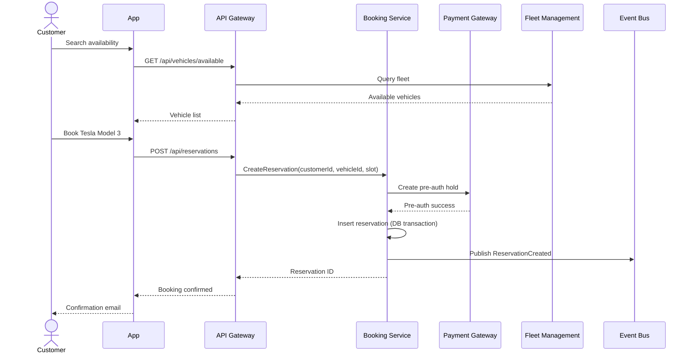

# Car/Van Rental - Key Sequence Diagrams

## SD-001: Booking Flow

## SD-002: Unlock & Start Rental
[Detailed sequence showing NFC/app unlock → rental session creation → telemetry start]

## SD-003: Return & Payment Capture
[Sequence showing photo upload → AI verification → payment finalization → fine calculation]

[Add 5-7 critical flows...]