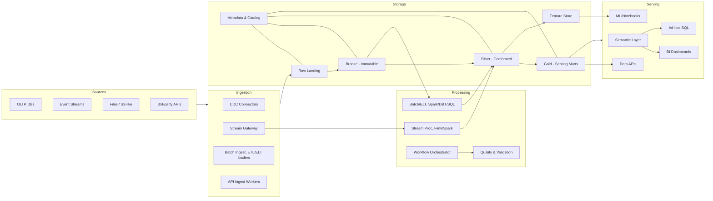

# Data Analytics Technology Architecture

## Purpose and Scope

This document outlines a production‑grade, end‑to‑end data analytics architecture that covers ingestion, persistence, processing, analytics, reporting, and visualization for our MobiCorp solution. It targets high availability and resiliency suitable for mission‑critical workloads, with an ambition of "five nines" service reliability for query and reporting surfaces where feasible.

----------

## Architecture Summary

-   **Data Domains**: [transactional](https://github.com/Oleggio/five-nines-arch-katas/blob/main/hld/core-func/README.md) (OLTP sources - our services), [vehicle event/stream data](https://github.com/Oleggio/five-nines-arch-katas/blob/main/hld/core-func/hld-vehicle-connectivity.md), files (batch), [third‑party APIs](https://github.com/Oleggio/five-nines-arch-katas/blob/main/hld/data-structure/data-sourcing.md), and reference/master data.
    
-   **Ingestion Modes**: streaming (low‑latency), micro‑batch, and bulk batch.
    
-   **Persistence Layers**: raw landing, bronze (immutable), silver (conformed), gold (serving marts), [feature store for ML](https://github.com/Oleggio/five-nines-arch-katas/blob/16bf176adafb834c43dca1f00c20506605f9dd11/hld/mlops/MLOps%20on%20Vertex%20AI%20&%20Gemini.md), and curated semantic layer for BI.
    
-   **Processing Paradigms**: ELT in scalable lakehouse, stream processing for near‑real‑time, orchestration for dependency control and SLAs.
    
-   **Analytics Surfaces**: SQL/BI, notebooks, programmatic ML, and governed APIs.
    
-   **Reliability**: multi‑AZ by default, optional multi‑region for RTO≈15 min and RPO≈0–5 min for critical paths.
    

----------

## High‑Level Diagram

----------

### Ingestion Layer

**Capabilities**

-   **Change Data Capture (CDC)** from OLTP sources to streaming bus; idempotent, exactly‑once semantics where supported.
    
-   **Streaming gateway** (Pub/Sub, optionally managed Kafka) with schema registry and topic ACLs.
    
-   **Batch loaders** for files and warehouse extracts, supporting checkpoint/manifest replay.
    
-   **API ingestion** workers with backoff, retry, and rate‑limit handling.
    

**Reliability & Ops**

-   Multi‑AZ brokers, replication factor ≥3, rack‑aware placement.
    
-   Dead‑letter queues, poison‑pill handling, and replay policies.
    
-   Observability: lag, consumer offsets, throughput, error rates.
    

### Persistence & Lakehouse
-   BigQuery datasets and BigLake external tables on GCS for the BigQuery‑centric path.
    
-   GCS buckets with Apache Iceberg tables for the open lakehouse path.

**Layers**

-   **Raw Landing**: encrypted object storage with immutable retention (WORM) and lifecycle policies.
    
-   **Bronze**: append‑only transactional tables (Apache Iceberg) retaining source‑native schema.
    
-   **Silver**: conformed, deduplicated, SCD handling, PII tokenization.
    
-   **Gold**: domain marts shaped for consumption and SLAs.
    
-   **Feature Store**: online + offline stores, point‑in‑time correctness.
    
-   **Metadata/Catalog**: centralized catalog, business glossary, data lineage.
    

**Data Management**

-   Schema evolution with contracts, Parquet for batch.
    
-   Partitioning + Z‑ordering/clustering for balanced IO; compaction jobs.
    
-   Encryption at rest (KMS‑managed keys), per‑tenant buckets/prefixes if needed.
    

### Processing

-   **Batch/Streaming/ELT**: Dataflow (Beam) for streaming and batch, Dataproc for Spark/Trino jobs, BigQuery SQL for ELT, Vertex AI for ML feature engineering and training.
    
-   **Orchestration**: DAG‑based scheduler (Airflow/Prefect/Dagster); retries with exponential backoff; SLAs and alerts; parametrized deployments via IaC.
    

### Analytics, Reporting, Visualization

-   **Semantic Layer**: governed metrics definitions, role‑based exposures, caching for sub‑second BI.
    
-   **BI**: certified dashboards for KPIs; self‑service spaces with guardrails; export scheduling.
    
-   **Ad‑hoc**: SQL workbench with query quotas and result caching.
    
-   **ML/Notebooks**: workspace with reproducible environments, model registry, and experiment tracking.
    
-   **Data APIs**: REST/GraphQL over Gold datasets, pagination and row‑level security (RLS).
-  **Tech Stack**: BigQuery and Looker for BI, Vertex AI Feature Store for ML, Cloud Run APIs over curated data, Pub/Sub for event outputs.
    

----------

## Security, Privacy, Governance

-   **Identity & Access**: SSO, least privilege, ABAC/RBAC, service principals for pipelines.
    
-   **Data Protection**: TLS in transit, KMS at rest, column‑level encryption for sensitive fields.
    
-   **PII/Compliance**: classification, masking/tokenization, differential access for GDPR.
    
-   **Lineage & Audit**: end‑to‑end lineage (ingest→transform→serve), audit logs retained ≥400 days.
    

----------

## Reliability Targets

-   **Core platform**: multi‑AZ baseline; health‑checked autoscaling; blue‑green for critical services.
    
-   **SLOs**: ingestion ≥99.99%, serving endpoints (semantic/BI APIs) up to 99.999% where multi‑region is enabled.
    
-   **Backups/DR**: hourly object‑versioning + daily snapshots; cross‑region replication; RPO 0–5 min streaming, 0–4 hrs batch; RTO ≤15–60 min depending on tier.
    

----------

## Observability & FinOps

-   **Metrics**: pipeline SLIs (freshness, completeness, accuracy), infra (CPU, IO, latency), query performance.
    
-   **Tracing**: OpenTelemetry for data services.
    
-   **Logging**: structured logs with correlation IDs; retention by tier.
    
-   **Cost**: unit economics per domain/table/dashboard; auto‑suspend clusters; storage lifecycle rules.
    
----------

## Data Quality & Contracts

-   Contract‑first ingestion with schema registry and data contracts (JSON Schema/Protobuf).
    
-   Automated tests at Bronze→Silver boundaries and pre‑publish checks for Gold.
    
-   Quarantine paths + remediation playbooks.
    

----------

## Deployment & IaC

-   Everything as code: infra (Terraform), pipelines (DAGs), transformations (dbt), permissions (policy‑as‑code).
    
-   Promotion flow: dev → test → prod with data‑free dry‑runs and data‑aware shadow runs.
    

----------

## Runbooks

-   **Pipeline failure**: identify stage, check DLQs, reprocess from checkpoint, validate downstream data quality, re‑enable SLAs.
    
-   **Schema drift**: block publish, negotiate contract, run backfill migration, resume.
    
-   **Hot path outage**: fail traffic to read replicas or alternate region; enable cached semantic responses.
    
