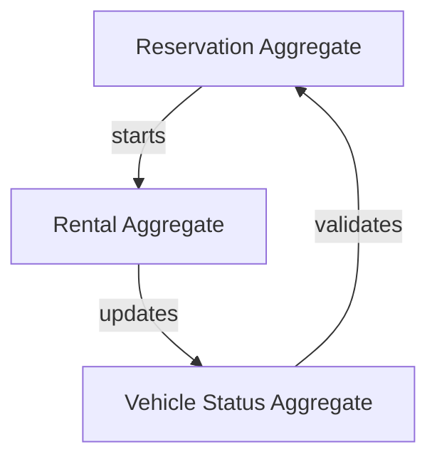

# Car/Van Rental - Domain Model

## Ubiquitous Language
**Bounded Context:** Car/Van Rental  
**Domain Experts:** Fleet Operations Manager, Customer Success Lead

### Core Terms
| Term | Definition | Example |
|------|------------|---------|
| **Reservation** | Pre-booked timeslot for vehicle usage | "Reservation #12345 for Tesla Model 3, Dec 18 10:00-12:00" |
| **Rental Session** | Active usage period from unlock to return | "Rental in progress, 47 minutes elapsed" |
| **Return Verification** | Photo + location proof of proper parking | "User submitted parking bay photo, AI verified charger connection" |
| **Pre-Authorization** | Payment hold before rental starts | "€150 pre-auth on Visa ending 4242" |
| **Fine** | Penalty charge for policy violation | "€25 late return fine, €50 dirty vehicle fine" |

### Aggregates

### Domain Events
- ReservationCreated
- ReservationCancelled
- RentalStarted
- TelemetryReceived
- RentalCompleted
- ReturnVerified
- FineApplied