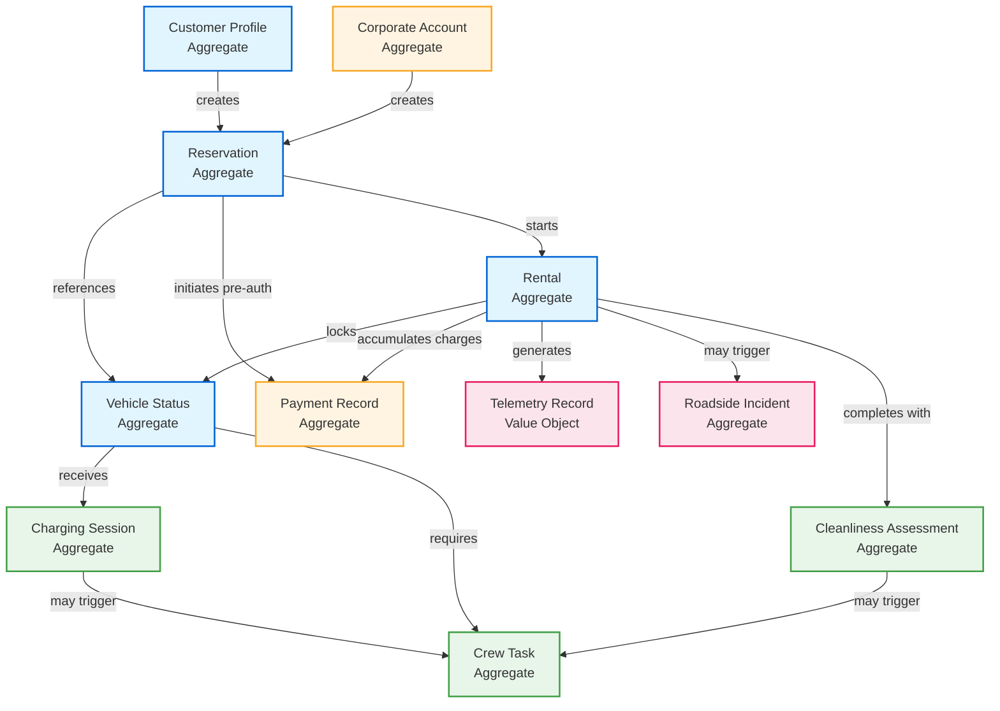

# Car/Van Rental - Domain Model

## Ubiquitous Language
**Bounded Context:** Car/Van Rental  
**Domain Experts:** Fleet Operations Manager, Customer Success Lead

### Core Terms
| Term | Definition | Example |
|------|------------|---------|
| **Reservation** | Pre-booked timeslot for vehicle usage | "Reservation #12345 for Tesla Model 3, Dec 18 10:00-12:00" |
| **Rental Session** | Active usage period from unlock to return | "Rental in progress, 47 minutes elapsed" |
| **Return Verification** | Photo + location proof of proper parking | "User submitted parking bay photo, AI verified charger connection" |
| **Pre-Authorization** | Payment hold before rental starts | "€150 pre-auth on Visa ending 4242" |
| **Fine** | Penalty charge for policy violation | "€25 late return fine, €50 dirty vehicle fine" |
| **Cleanliness Assessment** | AI-powered photo analysis of vehicle condition | "AI flagged interior stains, crew review required" |
| **Charging Session** | Vehicle charging at partner location | "Charged 45 kWh at Shell Recharge, Amsterdam" |
| **Crew Task** | Maintenance operation assignment | "Relocate fully-charged Vehicle #789 from charger bay to parking" |
| **Corporate Account** | B2B customer entity with multiple users | "Acme Corp account with 50 employees, monthly billing" |

### Aggregates

**Color Legend:**
- 🔵 **Blue** - Core Booking Flow (customer-facing rental lifecycle)
- 🟡 **Orange** - Payment & Financial (billing, pre-auth, fines)
- 🟢 **Green** - Operations & Maintenance (crew tasks, vehicle servicing)
- 🔴 **Pink** - Monitoring & Incidents (telemetry, roadside assistance)

**Aggregate Root Descriptions:**

1. **Customer Profile** - Individual user account with loyalty tier, favorites, preferences, payment methods
2. **Corporate Account** - B2B entity with multiple employee users, shared billing, usage reporting
3. **Reservation** - Booking with time window, vehicle reference, pre-authorization, recurring pattern support
4. **Rental** - Active usage session with start/end timestamps, billing accumulator, telemetry tracking
5. **Vehicle Status** - Real-time vehicle state (location, charge, availability, cleanliness, maintenance flags)
6. **Payment Record** - Financial transactions (pre-auth, charges, fines, refunds) with audit trail
7. **Crew Task** - Maintenance operations (relocation, cleaning, charging) with dispatch queue and route optimization
8. **Charging Session** - Vehicle charging activity at partner locations with kWh tracking and cost reimbursement
9. **Cleanliness Assessment** - Photo-based vehicle condition analysis (AI + human review) with fee calculation
10. **Roadside Incident** - Breakdown/assistance requests with issue type, location, resolution status
11. **Telemetry Record** - Time-series vehicle data (GPS, battery, speed) - modeled as Value Object for high-volume streaming

### Domain Events

**Reservation Lifecycle:**
- `ReservationCreated` - New booking made (single or recurring pattern)
- `ReservationModified` - Booking details changed (time, vehicle, location)
- `ReservationCancelled` - Booking cancelled by customer or system
- `RecurringPatternSkipped` - Individual occurrence skipped in recurring reservation

**Rental Lifecycle:**
- `RentalStarted` - Vehicle unlocked, session begins, billing starts
- `RentalExtended` - Duration extended during active session
- `RentalCompleted` - Vehicle returned, session ended
- `ReturnVerified` - Photos validated, parking confirmed, charger connected

**Vehicle Operations:**
- `VehicleStatusChanged` - Availability, location, or charge level updated
- `TelemetryReceived` - GPS, battery, speed data ingested (high-frequency)
- `ChargingStarted` - Vehicle connected to partner charger
- `ChargingCompleted` - Vehicle fully charged, may need relocation
- `VehicleDisabled` - Remote disable triggered for security/theft

**Payment & Financial:**
- `PreAuthorizationCreated` - Payment hold placed on customer card
- `PreAuthorizationReleased` - Hold released after cancellation
- `PaymentCharged` - Final rental cost captured
- `FineApplied` - Penalty assessed (late return, cleaning, improper charging)
- `RefundIssued` - Customer refund processed

**Cleanliness & Maintenance:**
- `CleanlinessAssessed` - AI analyzed return photos
- `CleaningFeeProposed` - Fee calculated, pending crew review
- `CleaningFeeConfirmed` - Crew approved fee, customer charged
- `CleaningFeeDisputed` - Customer challenged assessment
- `CrewTaskCreated` - Maintenance operation assigned (cleaning, relocation)
- `CrewTaskCompleted` - Task finished by crew member

**Incident Management:**
- `RoadsideIncidentReported` - Customer requested assistance
- `IncidentResolved` - Assistance completed, vehicle recovered

**Corporate Accounts:**
- `CorporateAccountCreated` - B2B customer onboarded
- `EmployeeAddedToAccount` - User granted access to corporate account
- `CorporateUsageReportGenerated` - Monthly billing report created

---

## Aggregate Consistency Boundaries

### Transactional Consistency (Strong)
Within a single aggregate, changes are **ACID-compliant** and immediately consistent:

- **Reservation Aggregate**: Booking details, pre-auth reference, recurring pattern rules
- **Rental Aggregate**: Session state, billing accumulator, current telemetry snapshot
- **Payment Record Aggregate**: Transaction state, fine calculations, refund tracking
- **Vehicle Status Aggregate**: Availability flag, location, charge level, maintenance state

### Eventual Consistency (Across Aggregates)
Cross-aggregate updates use **domain events** for eventual consistency:

- **Reservation → Vehicle**: `ReservationCreated` event updates Vehicle availability (eventually consistent)
- **Rental → Payment**: Billing events accumulate charges asynchronously
- **Cleanliness → Crew**: Assessment triggers task creation via event
- **Charging → Vehicle**: Charge completion updates vehicle status via telemetry events

**Rationale:** 
- Prevents distributed transactions across bounded contexts
- Enables independent scaling of aggregates
- Maintains system resilience during partial failures
- Supports event sourcing for audit trails

### Key Relationships

**1. Customer/Corporate → Reservation (1:Many)**
- One customer can have multiple active reservations
- One corporate account can have reservations across multiple employees
- Enforced at application layer, not FK constraint

**2. Reservation → Rental (1:1)**
- Each reservation may spawn one active rental session
- Rental references reservation ID but doesn't require FK
- Decoupled for flexibility (walk-up rentals in future)

**3. Rental → Vehicle (Many:1)**
- Multiple rentals (over time) reference same vehicle
- Vehicle status updated via events, not direct FK

**4. Rental → Payment (1:Many)**
- One rental generates multiple payment records (pre-auth, charges, fines)
- Payment aggregate references rental ID for correlation

**5. Vehicle → Crew Task (1:Many)**
- One vehicle may have multiple pending crew tasks
- Tasks reference vehicle ID but remain independent aggregate

**6. Rental → Cleanliness Assessment (1:1)**
- Each rental completion triggers one cleanliness assessment
- Assessment may exist independently for pre-rental checks

---

## Design Rationale

### Why These Aggregate Boundaries?

1. **Reservation as Aggregate Root:**
   - Booking is the customer's primary interaction point
   - Encapsulates all booking-related rules (conflicts, extensions, recurring patterns)
   - Pre-authorization lifecycle tied to reservation state

2. **Rental as Separate Aggregate:**
   - Active session has different lifecycle than booking
   - Billing accumulates in real-time during rental
   - Telemetry streaming requires separate scalability profile
   - Decoupling enables walk-up rentals (future scope)

3. **Vehicle Status as Aggregate:**
   - Vehicle is shared resource across many rentals
   - Real-time availability requires independent consistency
   - Charge level updated by telemetry, not rental events
   - Maintenance state managed by operations, not customers

4. **Payment Record as Aggregate:**
   - Financial transactions require audit trail isolation
   - Compliance mandates independent payment records
   - Enables payment gateway failures without blocking rentals
   - Supports complex refund/chargeback workflows

5. **Crew Task as Aggregate:**
   - Operations domain separate from customer rentals
   - Route optimization requires batch processing
   - Task assignment independent of vehicle availability
   - Enables crew mobile app to work offline

6. **Telemetry as Value Object:**
   - High-frequency time-series data (30-second intervals)
   - Immutable records, no business logic
   - Optimized for streaming ingestion and analytics
   - Not an aggregate root (no identity required)

---

## Related Documents
- Functional Requirements: `2_FRs.md` - Detailed acceptance criteria for each aggregate's behavior
- Integration Requirements: `5_Integration_Requirements.md` - API contracts and event schemas
- NFRs: `3_NFRs.md` - Performance, scalability, and consistency requirements